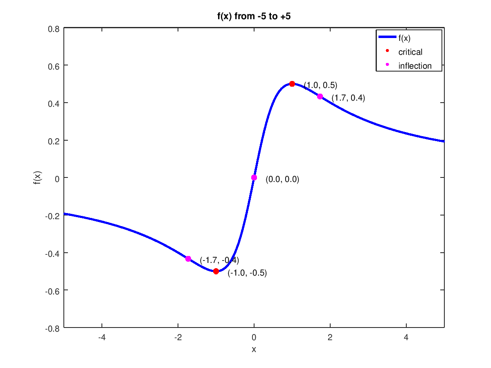

# Output

```bash
_ =

@(x) (x / ((x .^ 2) + 1))

f = (sym)

    x
  ──────
   2
  x  + 1

f_dash = (sym)

           2
      1 - x
  ─────────────
   4      2
  x  + 2⋅x  + 1

ans = (sym 2×1 matrix)

  ⎡-1⎤
  ⎢  ⎥
  ⎣1 ⎦

f_double_dash = (sym)

          ⎛ 2    ⎞
      2⋅x⋅⎝x  - 3⎠
  ────────────────────
   6      4      2
  x  + 3⋅x  + 3⋅x  + 1

ans = (sym 3×1 matrix)

  ⎡ 0 ⎤
  ⎢   ⎥
  ⎢-√3⎥
  ⎢   ⎥
  ⎣√3 ⎦
```	


