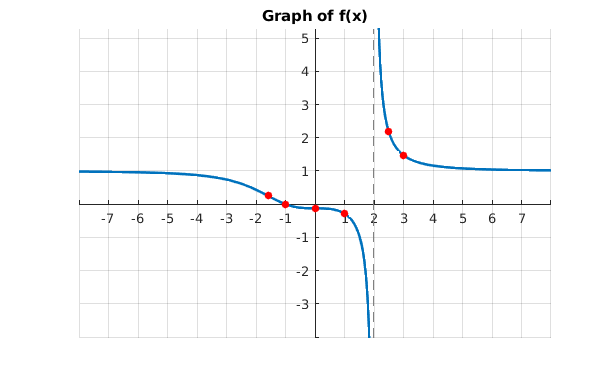

# Asymptote Example

## Output

```bash
num =
 
x^3 + 1
 
 
denom =
 
x^3 - 8
 
 
f =
 
(x^3 + 1)/(x^3 - 8)
 
Calculating first derivative...
 
f_dash =
 
-(27*x^2)/(x^3 - 8)^2
 
Calculating second derivative...
 
f_double_dash =
 
(108*x*(x^3 + 4))/(x^3 - 8)^3
 
 
hAsymptote =
 
1
 
 
vAsymptote =
 
2
 
 
criticalPoints =
 
 0
 0
 
 
inflectionPoints =
 
        0
 -4^(1/3)
 
 
otherPoints =
 
-1
 

miscPoints =

    1.0000
    2.5000
    3.0000
```

## Graph


